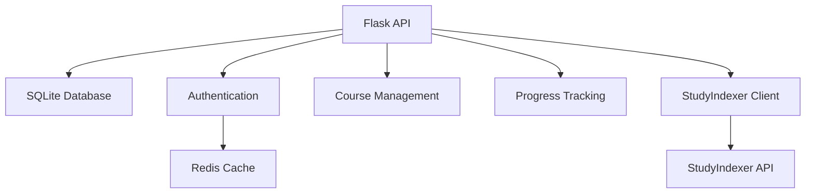

# Backend Service

The Backend Service is a Flask-based REST API that provides:
- User authentication and authorization
- Course and content management
- Student progress tracking
- Integration with StudyIndexer

## Overview

The Backend Service is a Flask-based REST API that provides:
- User authentication and authorization
- Course and content management
- Student progress tracking
- Integration with StudyIndexer

## Architecture



## Quick Start

```bash
# Create virtual environment
python -m venv venv
source venv/bin/activate  # or `venv\Scripts\activate` on Windows

# Install dependencies
pip install -r requirements.txt

# Initialize database
python scripts/init_db.py

# Start development server
python wsgi.py
```

## Key Components

### 1. Authentication System
- JWT-based authentication
- Role-based access control
- Token refresh mechanism
- Session management

### 2. Database Schema
```python
class User(db.Model):
    id = db.Column(db.Integer, primary_key=True)
    username = db.Column(db.String(80), unique=True)
    role = db.Column(db.String(20))
    # ... other fields

class Course(db.Model):
    id = db.Column(db.Integer, primary_key=True)
    code = db.Column(db.String(20), unique=True)
    name = db.Column(db.String(100))
    # ... other fields
```

### 3. API Structure
- RESTful design
- Versioned endpoints
- Comprehensive error handling
- Request validation

## API Reference

### Core Endpoints

1. **Authentication**
   ```http
   POST /api/v1/auth/login
   POST /api/v1/auth/refresh
   ```

2. **Course Management**
   ```http
   GET /api/v1/courses
   POST /api/v1/courses
   GET /api/v1/courses/{course_id}
   ```

3. **User Management**
   ```http
   GET /api/v1/users
   POST /api/v1/users
   GET /api/v1/users/{user_id}
   ```

For complete API documentation, see [Backend API Reference](../../api/BACKEND_API.md).

## Development Guide

### 1. Environment Setup
```bash
# Required environment variables
FLASK_ENV=development
SECRET_KEY=your-secret-key
DATABASE_URL=sqlite:///instance/studyhub.db
INDEXER_URL=http://localhost:8000
```

### 2. Database Management
```bash
# Initialize database
python scripts/init_db.py

# Add test data
python scripts/seed_db.py

# Reset database
rm instance/studyhub.db
python scripts/init_db.py
```

### 3. Testing
```bash
# Run all tests
python -m pytest

# Run specific test file
python -m pytest tests/test_auth.py

# Run with coverage
coverage run -m pytest
coverage report
```

## Deployment

### 1. Docker Deployment
```bash
# Build image
docker compose build backend

# Start service
docker compose up -d backend
```

### 2. Production Configuration
- Use production-grade database
- Configure proper logging
- Set up monitoring
- Enable rate limiting

## Troubleshooting

Common issues and solutions are documented in the [Troubleshooting Guide](../../project/TROUBLESHOOTING.md#backend-issues).

### Quick Fixes

1. **Database Issues**
   ```bash
   # Check database file
   ls -l instance/studyhub.db
   
   # Reset database
   rm instance/studyhub.db
   python scripts/init_db.py
   ```

2. **Authentication Issues**
   ```bash
   # Clear token cache
   redis-cli
   > KEYS "token:*"
   > FLUSHDB
   ```

3. **API Issues**
   ```bash
   # Check API status
   curl http://localhost:5000/health
   
   # Check logs
   tail -f logs/app.log
   ```

## Security Considerations

### 1. Authentication
- Secure password hashing
- Token expiration
- Rate limiting
- IP blocking

### 2. Data Protection
- Input validation
- SQL injection prevention
- XSS protection
- CSRF tokens

## Performance Optimization

### 1. Database
- Proper indexing
- Query optimization
- Connection pooling
- Result caching

### 2. API
- Response compression
- Cache headers
- Batch operations
- Async processing

## Contributing

1. Read the [Development Workflow](../../project/DEVELOPMENT_WORKFLOW.md)
2. Follow [Coding Standards](../../project/STANDARDS.md)
3. Submit PRs with tests and documentation

## Maintainers

- Michael (@michael) - Lead Architect
- Backend Team
- Security Team

## Version History
- v1.0 (Feb 2025) - Initial documentation
- v1.1 (Feb 2025) - Added security and performance sections 