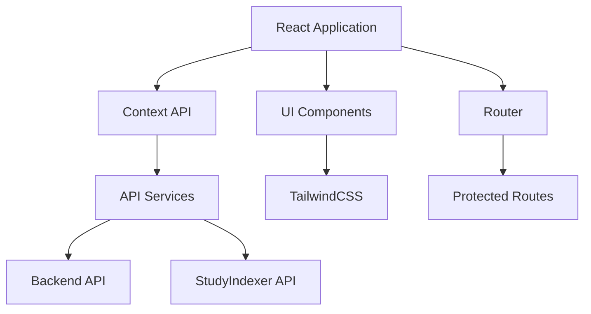

# Frontend Application

The Frontend Application is a React-based web interface that provides:
- Course management interface
- Document search and viewing
- Personal knowledge base
- Student progress tracking

## Overview

The Frontend Application is a React-based web interface that provides:
- Course management interface
- Document search and viewing
- Personal knowledge base
- Student progress tracking

## Architecture



## Quick Start

```bash
# Install dependencies
npm install

# Start development server
npm start

# Build for production
npm run build
```

## Key Components

### 1. Core Features
- Authentication flow
- Course management
- Document search
- Knowledge base
- Progress tracking

### 2. Component Structure
```
src/
├── components/
│   ├── common/          # Reusable components
│   ├── layout/          # Layout components
│   ├── course/          # Course-related components
│   ├── search/          # Search components
│   └── personal/        # Knowledge base components
├── hooks/               # Custom React hooks
├── services/            # API services
├── contexts/            # React contexts
└── utils/              # Utility functions
```

### 3. State Management
- Context API for global state
- Custom hooks for local state
- Service layer for API calls
- Local storage for persistence

## Component Library

### 1. Common Components
```jsx
// Button component example
export const Button = ({ 
  variant = 'primary',
  children,
  ...props 
}) => (
  <button
    className={`btn btn-${variant}`}
    {...props}
  >
    {children}
  </button>
);
```

### 2. Layout Components
```jsx
// Layout with sidebar
export const Layout = ({ children }) => (
  <div className="flex min-h-screen">
    <Sidebar />
    <main className="flex-1">
      <Navbar />
      {children}
    </main>
  </div>
);
```

## Development Guide

### 1. Environment Setup
```bash
# Required environment variables
REACT_APP_API_URL=http://localhost:5000/api/v1
REACT_APP_INDEXER_URL=http://localhost:8000
```

### 2. Development Flow
1. Start backend services
2. Run development server
3. Make changes
4. Test functionality

### 3. Testing
```bash
# Run all tests
npm test

# Run specific test
npm test src/components/search/__tests__/SearchBar.test.js

# Run with coverage
npm test -- --coverage
```

## Styling Guide

### 1. TailwindCSS Usage
```jsx
// Preferred style
<div className="flex items-center space-x-4 p-4 bg-white rounded-lg shadow">
  <h2 className="text-xl font-bold text-gray-900">Title</h2>
  <p className="text-gray-600">Content</p>
</div>

// Avoid
<div style={{ display: 'flex', padding: '1rem' }}>
  {/* ... */}
</div>
```

### 2. Theme Configuration
```javascript
// tailwind.config.js
module.exports = {
  theme: {
    extend: {
      colors: {
        primary: '#4F46E5',
        secondary: '#7C3AED'
      }
    }
  }
};
```

## Performance Optimization

### 1. Code Splitting
```javascript
// Lazy loading components
const DocumentViewer = React.lazy(() => 
  import('./components/documents/DocumentViewer')
);
```

### 2. Caching Strategy
- API response caching
- Asset caching
- Route pre-fetching
- State persistence

## Deployment

### 1. Docker Deployment
```bash
# Build image
docker compose build frontend

# Start service
docker compose up -d frontend
```

### 2. Production Build
```bash
# Create optimized build
npm run build

# Analyze bundle size
npm run analyze
```

## Troubleshooting

Common issues and solutions are documented in the [Troubleshooting Guide](../../project/TROUBLESHOOTING.md#frontend-issues).

### Quick Fixes

1. **Build Issues**
   ```bash
   # Clear dependencies
   rm -rf node_modules
   npm cache clean --force
   npm install
   ```

2. **Runtime Issues**
   ```bash
   # Clear local storage
   localStorage.clear()
   
   # Check console
   console.log(process.env.REACT_APP_API_URL)
   ```

## Security Best Practices

### 1. Authentication
- Secure token storage
- Token refresh handling
- Session management
- Route protection

### 2. Data Handling
- Input sanitization
- XSS prevention
- CSRF protection
- Secure forms

## Accessibility

### 1. ARIA Labels
```jsx
<button
  aria-label="Search documents"
  onClick={handleSearch}
>
  <SearchIcon />
</button>
```

### 2. Keyboard Navigation
- Focus management
- Skip links
- Keyboard shortcuts
- Focus trapping

## Contributing

1. Read the [Development Workflow](../../project/DEVELOPMENT_WORKFLOW.md)
2. Follow [Coding Standards](../../project/STANDARDS.md)
3. Submit PRs with tests and documentation

## Maintainers

- Michael (@michael) - Lead Architect
- Frontend Team
- UX Team

## Version History
- v1.0 (Feb 2025) - Initial documentation
- v1.1 (Feb 2025) - Added accessibility and performance sections 