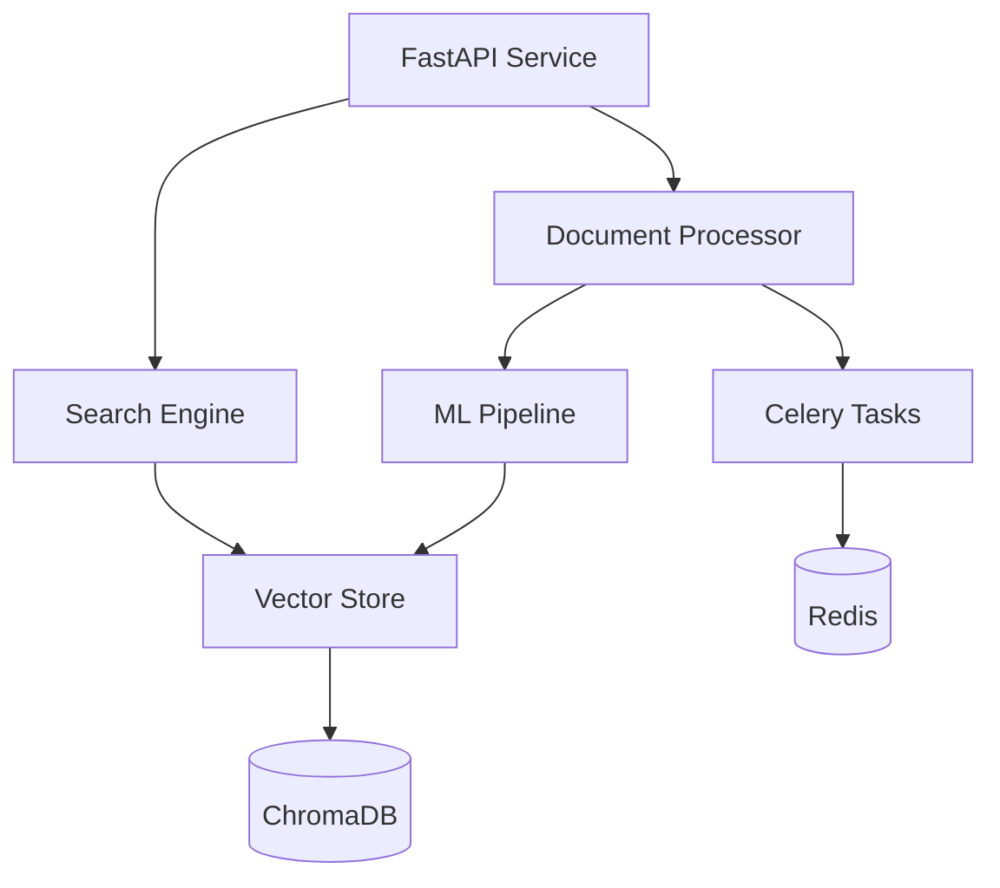

# StudyIndexer Service

StudyIndexer is a semantic search and document processing service built with FastAPI and ChromaDB. It provides:
- Document processing and indexing
- Semantic search capabilities
- Vector embeddings generation
- Multi-format document support

## Overview

## Architecture



## Quick Start

```bash
# Create virtual environment
python -m venv venv
source venv/bin/activate  # or `venv\Scripts\activate` on Windows

# Install dependencies
pip install -r requirements.txt

# Start development server
uvicorn main:app --reload
```

## Key Components

### 1. Document Processing
- Automatic text extraction
- Document chunking
- Metadata extraction
- Vector embedding generation

### 2. Search Engine
- Semantic search
- Faceted filtering
- Relevance scoring
- Result highlighting

### 3. Vector Store
- ChromaDB integration
- Efficient vector storage
- Fast similarity search
- Collection management

### 4. Task Queue
- Async processing
- Background tasks
- Job monitoring
- Error handling

## API Reference

### Core Endpoints

1. **Document Upload**
   ```http
   POST /api/v1/documents
   ```

2. **Semantic Search**
   ```http
   POST /api/v1/search
   ```

3. **Document Status**
   ```http
   GET /api/v1/documents/{document_id}
   ```

For complete API documentation, see [StudyIndexer API Reference](../../api/STUDYINDEXER_API.md).

## Development Guide

### 1. Environment Setup
```bash
# Required environment variables
CHROMA_HOST=localhost
CHROMA_PORT=8001
REDIS_HOST=localhost
REDIS_PORT=6379
```

### 2. Development Flow
1. Start dependencies (Redis, ChromaDB)
2. Run development server
3. Process test documents
4. Verify search functionality

### 3. Testing
```bash
# Run unit tests
pytest tests/unit

# Run integration tests
pytest tests/integration

# Run specific test
pytest tests/unit/test_processor.py -k "test_document_processing"
```

## Deployment

### 1. Docker Deployment
```bash
# Build image
docker compose build studyindexer

# Start service
docker compose up -d studyindexer
```

### 2. Production Configuration
- Use production-grade Redis
- Configure ChromaDB persistence
- Set appropriate resource limits
- Enable monitoring

## Troubleshooting

Common issues and solutions are documented in the [Troubleshooting Guide](../../project/TROUBLESHOOTING.md#studyindexer-issues).

### Quick Fixes

1. **ML Model Issues**
   ```bash
   # Clear model cache
   rm -rf ~/.cache/torch/sentence_transformers/
   ```

2. **ChromaDB Connection**
   ```bash
   # Verify connection
   curl http://localhost:8001/api/v1/heartbeat
   ```

3. **Redis Issues**
   ```bash
   # Check Redis
   redis-cli ping
   ```

## Contributing

1. Read the [Development Workflow](../../project/DEVELOPMENT_WORKFLOW.md)
2. Follow [Coding Standards](../../project/STANDARDS.md)
3. Submit PRs with tests and documentation

## Maintainers

- Michael (@michael) - Lead Architect
- ML Team
- Backend Team

## Version History
- v1.0 (Feb 2025) - Initial documentation
- v1.1 (Feb 2025) - Added deployment guide and troubleshooting 