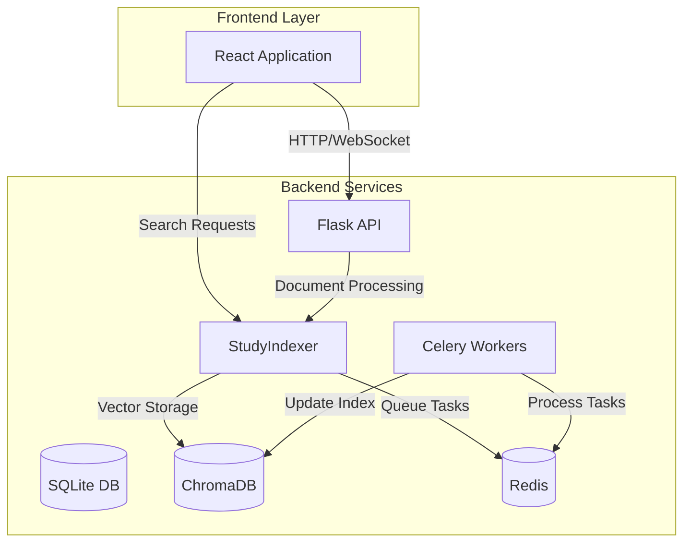
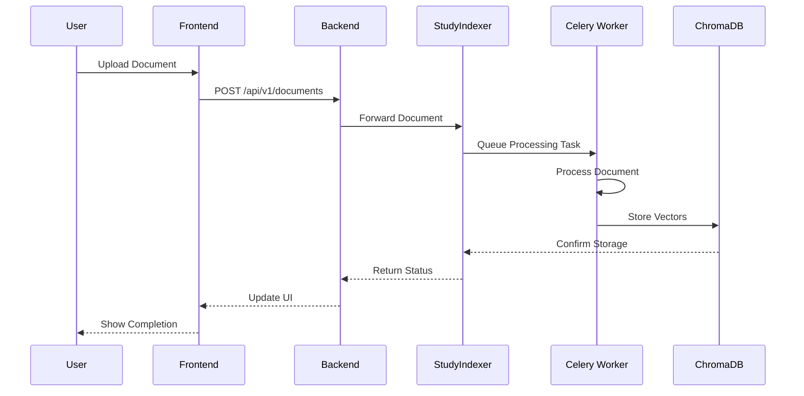
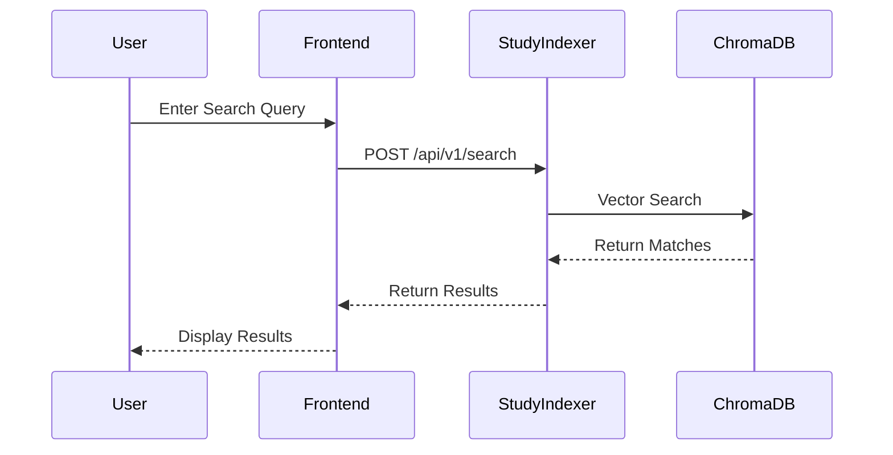

# StudyHub System Architecture

> "Architecture is about making the right decisions that are hard to change later." - Michael, Lead Architect

## System Overview

StudyHub is a distributed learning platform built with a microservices architecture. The system comprises four main services that work together to provide a comprehensive learning experience:

## Core Components

### 1. Frontend Application
- **Technology**: React 18 with TypeScript
- **State Management**: Context API + Custom Hooks
- **UI Framework**: Tailwind CSS
- **Key Features**:
  - Real-time updates via WebSocket
  - Responsive design
  - Progressive Web App capabilities
  - Client-side caching

### 2. Backend Service
- **Technology**: Flask with Python 3.10
- **Database**: SQLite (with migration path to PostgreSQL)
- **Authentication**: JWT with refresh tokens
- **Key Features**:
  - RESTful API design
  - Role-based access control
  - Event-driven architecture
  - Comprehensive error handling

### 3. StudyIndexer Service
- **Technology**: FastAPI with Python 3.10
- **Vector Database**: ChromaDB
- **ML Framework**: PyTorch + Transformers
- **Key Features**:
  - Semantic document search
  - Automatic document processing
  - Vector embeddings generation
  - Multi-format support (PDF, DOCX, etc.)

### 4. Celery Workers
- **Technology**: Celery 5.3
- **Message Broker**: Redis
- **Task Queues**:
  - Document processing queue
  - Indexing queue
  - Maintenance queue
- **Features**:
  - Automatic retries
  - Task prioritization
  - Dead letter queues
  - Task result backend

## Data Flow

### 1. Document Processing Flow

### 2. Search Flow

## Security Architecture

1. **Authentication**
   - JWT-based authentication
   - Refresh token rotation
   - Role-based access control
   - API key authentication for services

2. **Data Protection**
   - TLS encryption in transit
   - Secure credential storage
   - Input validation
   - Output sanitization

3. **API Security**
   - Rate limiting
   - CORS configuration
   - Request validation
   - Error handling

## Scalability Considerations

1. **Horizontal Scaling**
   - Stateless services
   - Container orchestration ready
   - Load balancer compatible
   - Session management via Redis

2. **Performance Optimization**
   - Caching strategies
   - Async processing
   - Batch operations
   - Resource pooling

3. **Resource Management**
   - Container resource limits
   - Database connection pooling
   - Worker concurrency control
   - Memory management

## Development Practices

1. **Code Organization**
   - Feature-based structure
   - Clear separation of concerns
   - Dependency injection
   - Interface-driven design

2. **Testing Strategy**
   - Unit tests (pytest, Jest)
   - Integration tests
   - End-to-end testing
   - Performance testing

3. **Deployment Pipeline**
   - Continuous Integration
   - Automated testing
   - Docker-based deployment
   - Environment management

## Monitoring and Observability

1. **Health Checks**
   - Service health endpoints
   - Dependency checks
   - Resource monitoring
   - Error tracking

2. **Logging**
   - Structured logging
   - Log aggregation
   - Error reporting
   - Audit trails

3. **Metrics**
   - Performance metrics
   - Business metrics
   - Resource utilization
   - User analytics

## Future Considerations

1. **Planned Improvements**
   - PostgreSQL migration
   - Kubernetes deployment
   - Service mesh implementation
   - API gateway integration

2. **Scalability Enhancements**
   - Distributed caching
   - Read replicas
   - Sharding strategy
   - CDN integration

3. **Feature Roadmap**
   - Real-time collaboration
   - Advanced analytics
   - Machine learning enhancements
   - Mobile applications

---

*"The architecture isn't just about the technology stack; it's about making the right tradeoffs for our specific needs." - Michael*

## Version History
- v1.0 (Feb 2025) - Initial architecture document
- v1.1 (Feb 2025) - Added sequence diagrams and security section 